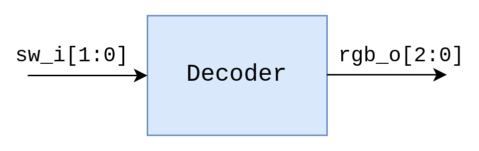
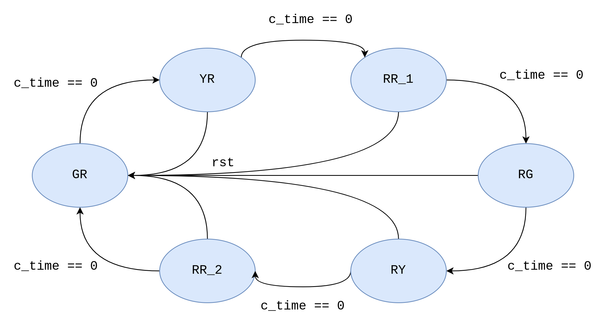
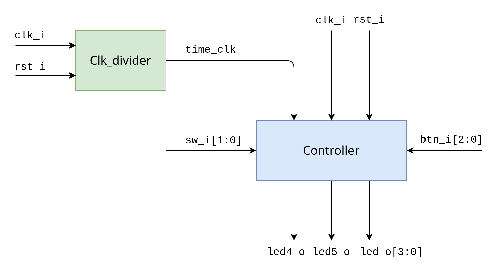

# FPGA-TrafficLight

>  2022 Spring NCKU FPGA Course
> 
>  Homework 1 
> 
>  E24076239 E24076297 E24076750

## Problem1: RGB LED

### Introduction

This project uses **PYNQ-Z2** to implement an RGB control circuit.

#### Mode

| Switch | Color  |
| ------ | ------ |
| 00     | White  |
| 01     | Red    |
| 10     | Green  |
| 11     | Yellow |

### Modules

`Decoder.v` is the only module used in this project which maps the input switch to output RGB color. We decode the input signal( `sw_i[1:0]` ) using a `case` statement and the corresponding output(`rgb_o[2:0]`) will determined the color of RGB LEDs.    

### Schematic

    
  

## Problem2: Traffic Light

## Introduction

This project uses **PYNQ-Z2** to implement a traffic light finite state machine. Users can adjust the duration of each state(from 1 to 15 seconds) via the switch and buttons on PYNQ-Z2 board.

### State Diagram

    
  

The first letter of each state name indicates the color of `led4` , the second is the color of `led5`.

The transitions between states occur automatically when the remaining time( `c_time` ) of the current state becomes zero. When the asynchronous reset signal(`rst`) is received, the system returns to `GR` regardless of the current state.

### Specification

<table>
    <tr>
        <td><b>Switch</b></td>
        <td><b>RGB LEDs</b></td>
        <td><b>BTNs</b></td>
        <td><b>LEDs</b></td>
        <td><b>State</b></td>
    </tr>
    <tr>
        <td>00</td>
        <td>Operate properly</td>
        <td></td>
        <td>Display remaining time in seconds</td>
        <td>Operate properly</td>
    </tr>
     <tr>
        <td>01</td>
        <td>Red+Green</td>
        <td rowspan="3"><tt>BTN[0]</tt>: reset <tt>BTN[1]</tt>: add one second <tt>BTN[2]</tt>: minus one second</td>
        <td>Display the duration of <b>red</b> light and <b>green</b> light</td>
        <td>Adjust the duration of <b>red</b> light and <b>green</b> light</td>
    </tr>
    <tr>
        <td>10</td>
        <td>Yellow</td>
        <td>Display the duration of <b>yellow</b> light</td>
        <td>Adjust the duration of <b>yellow</b> light</td>
    </tr>
    <tr>
        <td>11</td>
        <td>White</td>
        <td>Display the duration of <b>red</b> lights</td>
        <td>Adjust the duration of <b>red</b> lights</td>
    </tr>
</table>

We use a debounce counter(`db_cnt[27:0]`) here to implement a **debounce circuit** for the buttons. The value of the debounce counter will be set to zero when the button is pressed at `posedge clk_i` and accumulated in each cycle until the value reaches `28'h1fffffff`. When the value of the debounce counter is less than `28'h1ffffffff`, the controller will ignore any action on the buttons.

### Modules

1. **Controller** module
   
   The major part in this project, controlling the state transition and handling user input(switch and button).
   
   In this module, state transitions, user input handling, and LEDs are controlled by sequential logic, while combinational logic is responsible for the output color of RGB LEDs.

2. **Clk_divider** module
   
   Divide the primary clock to approach actual time in seconds.

### Schematic

    

## Discussions

1. Why add `blinky.xdc`?

   The `create_clock` command is used to define the primary clock of our design, and the `create_generated_clock` command defines the generated clock that follows the master clock, which is the primary clock in our design.

2. In the development process of Vivado, what is the difference between the results of **Synthesis** and **Implementation**?
   
   The **placement** and **routing** is finished after **Implementation**.
